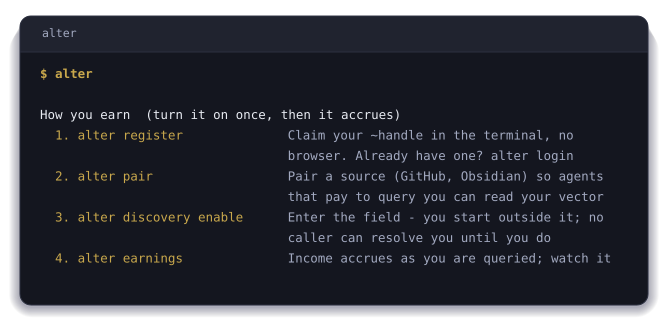
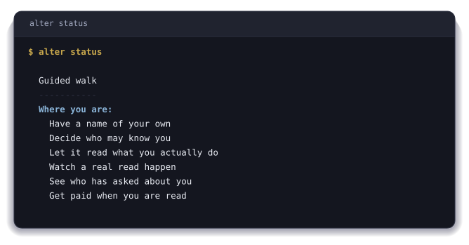
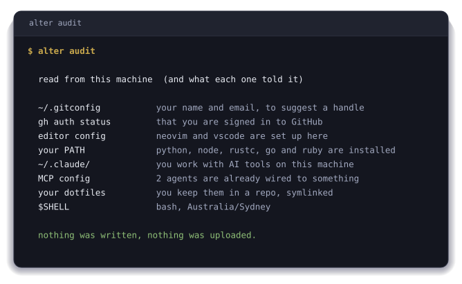
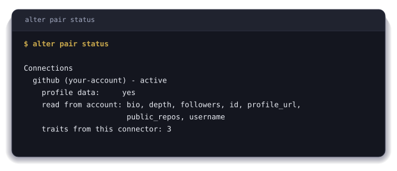

<div align="center">


# ~alter CLI

**Claim a name that is yours and get paid when someone reads it.**

[](https://www.npmjs.com/package/@truealter/cli)
[](https://github.com/true-alter/homebrew-tap)
[](https://mcp.truealter.com/api/v1/mcp)
[](https://smithery.ai/servers/true-alter/alter-identity)
[](#install)
[](./LICENSE)

[What is ~alter?](#what-is-alter) · [Install](#install) · [The first five minutes](#the-first-five-minutes)

</div>

## What is ~alter?

Run `alter register`, choose a name and confirm you are eighteen or older. Your
own machine spends a few seconds proving there is a person behind the request,
and then `~yourname` exists.

A second before that command there was no you on this protocol, and afterwards
there is one that is yours. No browser opened, no password was set, no email
address was asked for, and no card was taken.

`~alter` is what that name resolves to. `~yourname` is an address, and behind it
sits a record of what you have actually done. Every command below reads or
writes some part of it, and anything else speaking the protocol resolves the
same address to the same record.

The step is that small, and it is the one everything else here runs from. Agents
you wire on this machine act under the name, so what they do in your stead
carries it. Anybody wanting more of you than the fact you exist pays for it on
terms you set first, and `alter queries` names each of them and what you kept.

Nothing else in the stack is where a name starts. The
[website](https://truealter.com) argues the case, the
[runtime](https://github.com/true-alter/runtime) keeps a handle known on your
own machine, and the [SDK](https://github.com/true-alter/sdk) reads one from
code you have written. Each of those begins with a name that already exists,
and this is the command that makes one.

<details><summary><b>I want to know more</b></summary><br><p>Your friends do not know you from a login. Neither does your family, or the people you work with, or your sports team. They know who you are from how you have shown up, over years. You may look and sound nothing like you did ten years ago and it is still you.</p><p>Software still asks the narrow question. A password at the login screen. A token in the app. Each one checks whether this is the right person, right now, at this exact spot, and then looks away. Everything in between is invisible to it, and that is almost all of your life. The AI tools made it worse, because one of them writes in your name now, and when somebody asks who allowed it, there is no answer anywhere on this machine.</p><p><b>One name, and the record under it is yours.</b> <code>~yourname</code> works at every tool that speaks the protocol, so nothing is set up twice and there is no key to paste, at any point. What is in the record was read from what you did, not typed into a box by you or guessed at by a model. You can cut off access to any of it with one command. No form, no review.</p><p><b>Being read pays you.</b> Anyone can check for free that your handle exists. Reading further, past the fact of you, costs the reader money, that money goes to you, and you decide who gets to read what. Collectives hold a record on the same terms, because it is one record at every scale and the same form holds you, your team, and your country. A union, a club, a trade body, or a group of people who have never met can vouch for their own members and be read the same way you are.</p><p><b>Threads are how you get somewhere.</b> A thread is something you are working towards. You take one on yourself, or ~Alter plants one from what it can already see, or a collective confers one on you. What gets read is the trail you leave while you are doing it, never a certificate at the end.</p><p>All of that is the short version of an argument set out properly, in eight chapters at <a href="https://truealter.com/origin">truealter.com/origin</a>. Its seventy-six predictions were each written so the data could come back and say no. Five of them did, and those five are still published alongside the rest.</p></details>

<details><summary><b>I want to check it myself</b></summary>

None of it needs taking on trust. Hand this to the AI you already use and
let it take you through in your own words.

```text
Go to truealter.com, find the genesis and the origin
papers, and read all of them. Then start a discussion
with me in my own language, no jargon.

Ask me one question at a time and wait for my answer.
Follow what I am curious about, not the order the site
is written in.

Do not only read the pages. Connect to their interface
directly and call get_started. That tells you where I am
and what comes next, and we work the rest of this from
there.

If I have a ~handle I will give it to you. If I do not
and I decide I want one, set it up with me here.

What I want to understand is what ~Alter is, how it
applies to me, and what it means for everyone else. Find
me somewhere in it, and not the version written for
people who work in technology. Find the life nearest
mine and walk me through it, including what it would
cost me.

Try to prove them wrong. Go and find where they show
their working, and if something is unclear or does not
hold up, say so.
```

</details>

## What is ~alter CLI?

One binary, and every command in it runs under your own handle. Nothing to
paste, no key to carry between machines, and no browser step at any point.

It covers six things. Holding a name that is yours and keeping it safe. Deciding
who may read you, attribute by attribute. Connecting the sources it reads what
you do from. Seeing who looked you up and what each read paid you. Running your
agents under your handle, so what they do carries it. Asking the field for
somebody when you know nobody who would know them.

Two of those need no account at all. `alter audit` reads this machine, prints
what ~Alter could learn from it, and stops. `alter doctor loom` checks a folder
for secrets, bad encoding and broken links, with no network. Both run before you
decide anything.

The rest of this page is the install, and the first five minutes.

## Install

Nothing needs setting up first. The installer brings its own Node when the
machine has none. Take the line for the shell you are in.

**macOS, Linux and WSL**

```bash
curl -sSf https://truealter.com/install.sh | bash
```

**Windows PowerShell**

```powershell
irm https://truealter.com/install.ps1 | iex
```

### What that puts on your machine

Four things land, and the rest of this section is what does not.

- The `alter` command, which is the npm package
  [`@truealter/cli`](https://www.npmjs.com/package/@truealter/cli), installed
  globally.
- One directory on your `PATH`, so `alter` is there in every shell you open.
- Node, but only if this machine has none. macOS and Linux take the official
  build, check it against the checksums [nodejs.org](https://nodejs.org)
  publishes, and unpack it into `~/.local/share/alter/node`. Windows installs
  Node LTS through winget, or Chocolatey when winget is not there. Node already
  here is left alone.
- A checksum for the installer itself, at `install.sh.sha256` and
  `install.ps1.sha256`, so you can check the script before you run it.

Nothing runs under `sudo`. The installer refuses to run as root, because root
would own Node, npm and `alter`, and you would not be able to run the command at
all. macOS asks for a password once, to link the binary into `/usr/local/bin`,
and nothing else needs administrator rights on either platform. Nothing lands
outside your home directory.

No account is created and nothing is sent. When the install finishes ~Alter has
read nothing about you or about this machine. `alter audit` is the first command
that reads anything, and it reads locally. `alter register` is the first that
creates anything, and you run it yourself.

<details><summary><h3><a href="https://github.com/true-alter/homebrew-tap">Homebrew</a>, on macOS or Linux</h3></summary>

- **Take this one if** you want Homebrew to own the copy on this machine and
  upgrade it alongside everything else you have installed.
- **It brings its own Node.**

```bash
brew install true-alter/tap/alter
```

</details>

<details><summary><h3>Arch Linux, from <a href="https://aur.archlinux.org/packages/truealter-cli">the AUR</a></h3></summary>

- **Take this one on Arch or a derivative,** so `pacman` knows about it like
  anything else on the machine.
- **`paru` works the same way,** with `paru -S truealter-cli`.

```bash
yay -S truealter-cli
```

</details>

<details><summary><h3>npm, if you would rather not run a script</h3></summary>

- **Take this one when Node 20 or newer is already here** and you would rather
  install the package yourself.
- **It is the same package the installer above puts there,** without the Node
  and `PATH` handling.

```bash
npm install -g @truealter/cli
```

</details>

## The first five minutes

Run `alter` on its own.

The menu opens on the four commands that turn earning on.

<div align="center">



</div>

After that there is one command to remember. Start this today, get pulled away,
and come back next week not knowing what is left, and `alter status` names which
of six steps you are on and what to do next. Those six steps are the sections
below.

<div align="center">



</div>

### Read your own machine before anything is created

Run `alter audit`.

You have not decided anything yet and want to see what it would read off your
own machine first. It reads this machine, prints what ~Alter could learn from
it, and stops. Nothing is sent and nothing is created.

<div align="center">



</div>

Close the terminal here and you are exactly where you started.

### 1. Register, and take the handle

Run `alter register`.

Free, and it asks for no account, no card and no application. Use
`alter login` instead if the handle is already yours.

Nothing is printed for you to write down. The handle is claimed, a member
credential is minted onto this machine, and the session is stored for you. The
secret worth keeping is the root seed, which `alter key device register` mints
and shows once, on the run that mints it. Run `alter key seed export` to see it
again on that machine and `alter key seed import` to put it on a new one. No
server holds it, so nobody can reissue it for you.

### 2. Preview the record a caller would get

Run `alter discovery preview` first.

Say you are happy to be found for the trade you do and for nothing else. This
prints your record the way a caller would receive it, with the price on that
read, before anybody is able to make one.

The levels are set by `alter discovery preset recognition`. There are four, and
they apply attribute by attribute.

| Level | What a caller gets |
|---|---|
| `hidden` | Nothing. Not surfaced at all |
| `match_only` | Counts toward a ranking. The value is never shown |
| `tier_label` | A band, never the raw number |
| `exact` | The literal value |

Three presets are the starting points, `minimal`, `recognition` and `open`, and
`alter discovery set` moves one attribute off whichever you picked.

### 3. Pair the places you already work

Run `alter pair`.

Run it with nothing after it and you get the menu. GitHub, GitLab, Discord,
Mastodon, Bluesky, ORCID, Steam, Lichess, a domain you control, an Obsidian
vault. Naming one, `alter pair github`, skips the menu. Neither route opens a
browser at you, both hand you a code to type in.

You already do the work somewhere. What comes back is what you did there, not
what you say about it. None of it belongs to the source, so it survives leaving
the source. Use `alter connections` to list them, `alter pair status` to see
what each returned, and `alter unpair <id>` to drop one.

<div align="center">



</div>

### 4. Make the handle resolve

Run `alter discovery enable`.

Until you run it your handle does not resolve at all. After it, a caller gets
what step 2 allows and nothing else. Running `alter discovery disable` takes you
back out with the settings intact.

### 5. Every read, with the price on it

Run `alter queries`.

You have applied for nothing and somebody has looked you up anyway. Who asked,
what they paid, what you kept. It is the log itself, not a summary of it, and
yours costs nothing to read. Anybody's access ends from here with
`alter consent revoke`.

### 6. The balance, and the two things that open withdrawal

Run `alter earnings`.

The balance moves whether or not you can withdraw yet. Two things open
withdrawal, and the readiness line in the menu says where each of them stands.

Your email has to be confirmed, because nothing accrues from a query against an
unconfirmed address, and a payout wallet has to be registered with
`alter wallet register`. Withdrawal opens at Augmented, the third of four levels,
and the balance keeps building until you reach it.

### Wire the agents already on this machine

Run `alter wire`.

You use one of those every day and would rather not explain who you are to it
every time you open it. It finds the AI harnesses installed here and connects
each of them to the rail. What an agent does in your name then carries your
handle, and turns up in `alter queries` like any other read.

<details><summary><h3>What people do with it</h3></summary>

`alter ask` is the one to try first. It queries the field by situation instead
of by name, and it costs $1.00 a call, which is the same dollar landing in
somebody else's `alter earnings` when they are the answer. The whole economy in
one command, seen from both ends.

Somebody messages you offering work and signs off as ~sam, and you want to know
there is a person behind that before you answer. `alter verify` answers it and
costs nothing. So does `alter doctor loom`, which reads a folder you are about to
send somebody and tells you a password is not sitting in one of the files.

| You want to | Run |
|---|---|
| Find people by situation rather than by name | `alter ask --trait ...` |
| Check whether a handle is real, free | `alter verify <handle>` |
| Check a folder before you send it, offline | `alter doctor loom ./folder` |
| Let one peer query alignment with you | `alter alignment grant ~peer` |
| See how your traits have moved | `alter traits`, `alter portfolio` |
| Dispute something the field recorded about you | `alter contest` |
| Read your own signals as they land | `alter signals tail` |

</details>

<details><summary><h3>What the commands cover</h3></summary>

| What you want to do | The commands |
|---|---|
| Hold a name that is yours | `register`, `login`, `handle`, `whoami`, `about` |
| Keep the account safe | `passkey`, `mfa`, `key`, `password`, `sessions`, `creds` |
| Get paid | `earnings`, `identity-income`, `portfolio`, `cash-out`, `queries`, `wallet` |
| Show what you can do | `pair`, `unpair`, `discovery`, `traits`, `signals` |
| Control what is read, and see who read it | `consent`, `forget`, `queries`, `audit` |
| Agree terms with someone | `accord`, `alignment`, `room`, `coord` |
| Talk to people and agents | `msg`, `email`, `thread`, `brief`, `ask` |
| Run agents under your handle | `wire`, `unwire`, `mcp-bridge`, `agent`, `hooks`, `skills`, `runtime` |
| Check everything is healthy | `doctor`, `status`, `config`, `style` |

`alter help` lists every command, and the interactive menu groups them the same
way.

An accord is where two parties who have never met agree a paid job. Each side
has a name, both sign the same terms, what gets done is recorded, and payment
lands in USDC on those terms. No company sits in the middle holding the work,
the money or the relationship.

</details>

<details><summary><h3>Wiring the tools you already use</h3></summary>

`alter wire` covers the harnesses on your machine. If you would rather connect
something by hand, or you are on a client that reads its own config, point it at
the hosted endpoint:

```
https://mcp.truealter.com/api/v1/mcp
```

Codex reads that from its config file. ChatGPT takes it as a custom connector.

</details>

<details><summary><h3>Where this goes</h3></summary>

The six steps are only the start.

A thread is something you are working towards. You take one on, or one is
planted from what the field can already see, or a collective confers one on you.
What gets read is the trail you leave while doing it, never a certificate at the
end.

A collective holds a record on the same terms you do, and can vouch for its own
members. A team, a union, a club or a trade body, one record at every scale.

The [runtime](https://github.com/true-alter/runtime) keeps your handle known on
this machine without the command line running, and `alter help advanced` covers
the MCP wiring.

The deep-dives are all in the terminal, at `alter help getting-started`,
`alter help earning`, `alter help concepts` and `alter help advanced`. None of
them send you to a web page.

</details>

<details><summary><h3>Keeping it current</h3></summary>

```bash
npm update -g @truealter/cli
```

On the Homebrew path it is `brew update && brew upgrade alter` instead. Either
way you get the current release, and `alter --version` says which one you are
on.

</details>

<details><summary><h3>If something goes wrong</h3></summary>

Run `alter doctor` first. It checks the install, the session and the
connections, then tells you which one is unhappy.

If it reports a session problem, `alter login` is the answer. You will never be
asked to create, obtain or paste a token or a key to fix something. If any
message ever tells you to, that is a defect on our side, and it is worth
[an issue](https://github.com/true-alter/cli/issues).

</details>

<details><summary><h3>The protocols underneath it</h3></summary>

The record formats are open Internet-Drafts, so somebody else's implementation reads and writes the same records this one does without asking us. These are the drafts this repository actually rests on.

| Draft | What it specifies |
|---|---|
| [`mcp-dns-discovery`](https://datatracker.ietf.org/doc/draft-morrison-mcp-dns-discovery/) | The DNS records that publish a `~handle`, the server that answers for it, and the signed envelope bound to it. |
| [`alter-uri-scheme`](https://datatracker.ietf.org/doc/draft-morrison-alter-uri-scheme/) | The `alter:` URI, so a `~handle` reference resolves, verifies and dispatches to a handler on the machine. |
| [`identity-pronouns`](https://datatracker.ietf.org/doc/draft-morrison-identity-pronouns/) | Session-scoped references that resolve to a concrete handle on the client before anything reaches the wire. |
| [`consent-settlement`](https://datatracker.ietf.org/doc/draft-morrison-consent-settlement/) | Binding a paid read of somebody's identity to their own recorded consent, and settling part of that payment to them. |

Eighteen drafts make up the whole stack. The rest are on the [IETF datatracker](https://datatracker.ietf.org/doc/search/?name=draft-morrison&activedrafts=on).

</details>

<details><summary><h3>The rest of it</h3></summary>

`~alter` is one identity rail with several ways in, and this command line is the
front door for a person.

| Name | What it is |
|---|---|
| **cli** | The command line, and the front door for a person. **You are here.** |
| **[homebrew-tap](https://github.com/true-alter/homebrew-tap)** | That command line, packaged for macOS and Linux. |
| **[runtime](https://github.com/true-alter/runtime)** | The daemon that keeps your `~handle` known on your own machine. |
| **[sdk](https://github.com/true-alter/sdk)** | Reading identity from your own code. |
| **[obsidian](https://github.com/true-alter/obsidian)** | ~Alter inside an Obsidian vault, on-device. |
| **[mcp-ollama](https://github.com/true-alter/mcp-ollama)** | Local models, for work that should stay on the machine it runs on. |

| Where to read more | |
|---|---|
| Website | [truealter.com](https://truealter.com) |
| The reasoning behind it | [truealter.com/origin](https://truealter.com/origin) |
| Getting started | [truealter.com/build](https://truealter.com/build) |
| What the tools do | [truealter.com/docs/mcp/tools](https://truealter.com/docs/mcp/tools) |
| The open specifications | [the draft stack](https://datatracker.ietf.org/doc/search/?name=draft-morrison&activedrafts=on) |

This repository is the public home of the released command line, and the npm
release runs from here. The source arrives on a separate branch written by
automation, so a pull request against it cannot be accepted.
[Issues](https://github.com/true-alter/cli/issues) are the way to reach us.
Security reports go to [security@truealter.com](mailto:security@truealter.com),
never a public issue, and [`SECURITY.md`](./SECURITY.md) has the detail.
Apache-2.0, see [`LICENSE`](./LICENSE).

</details>

---

<div align="center">

<sub><b>~alter</b> is identity infrastructure. Your name is <code>~yourname</code> and claiming one is free.</sub>

<sub>
<a href="https://truealter.com">Website</a> &nbsp;·&nbsp;
<a href="https://truealter.com/docs">Docs</a> &nbsp;·&nbsp;
<a href="https://truealter.com/origin">The argument in eight chapters</a> &nbsp;·&nbsp;
<a href="https://datatracker.ietf.org/doc/search/?name=draft-morrison&activedrafts=on">The open specifications</a> &nbsp;·&nbsp;
<a href="https://github.com/true-alter">Every repository</a>
</sub>

</div>
